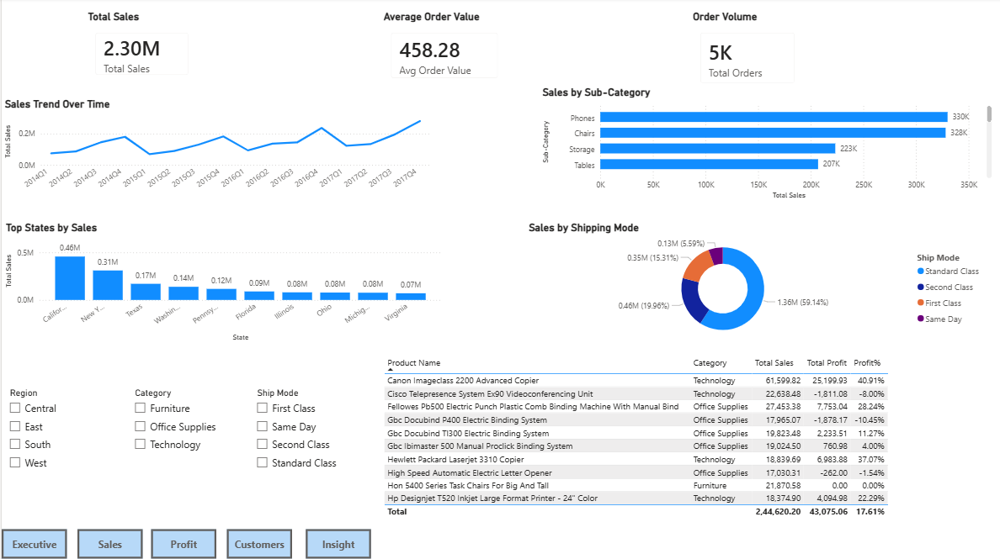
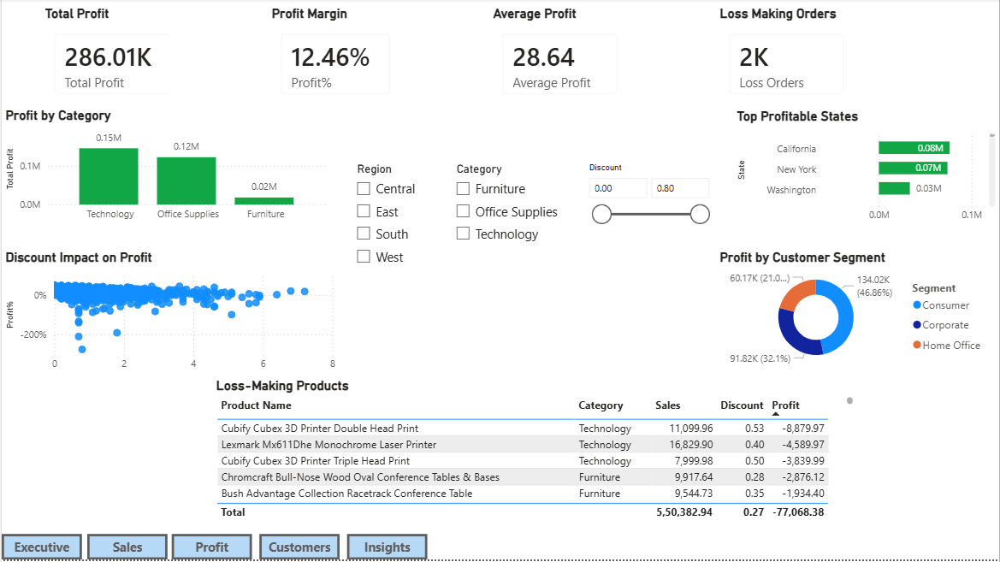
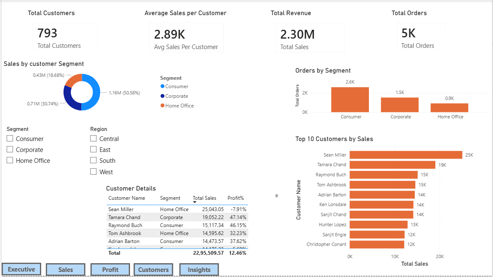
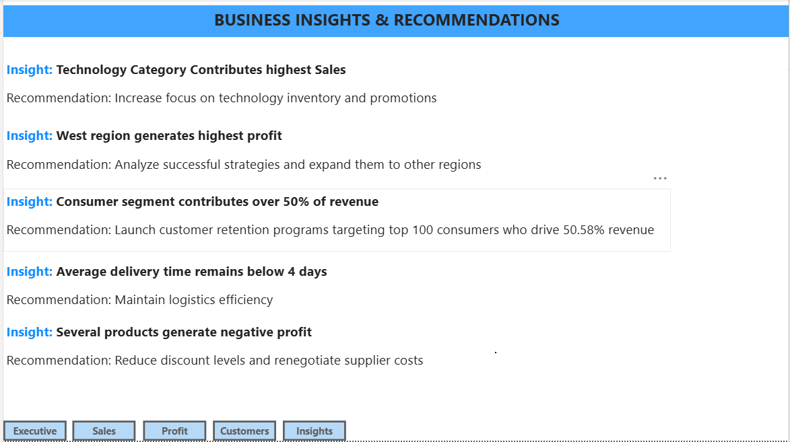

Superstore Sales & Profit Analysis Dashboard

Project Overview

This project is an interactive Power BI dashboard developed using the Superstore dataset to analyze sales performance, profitability, customer behavior, and business insights.

Tools Used

- Power BI
- Power Query
- DAX
- Microsoft Excel

Dashboard Pages

Executive Overview

- Total Sales
- Total Profit
- Profit Margin
- Sales Trend Analysis
  
Sales Analysis

- Top States by Sales
- Sub-Category Performance
- Shipping Mode Analysis

Profit Analysis

- Profitability by Category
- Discount Impact on Profit
- Loss-Making Products

Customer Insights

- Customer Segmentation
- Top Customers
- Revenue Analysis

Business Insights & Recommendations

- Business Findings
- Actionable Recommendations

Key Insights

- Technology category generated the highest sales.
- West region produced the highest profit.
- Consumer segment contributed the largest share of revenue.
- High discounts negatively impacted profitability.

- ### Executive Overview
.png)

### Sales Analysis

### Profit Analysis

### Customer Insights

### Business Insights & Recommendations

